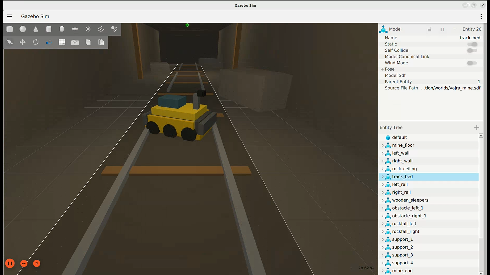
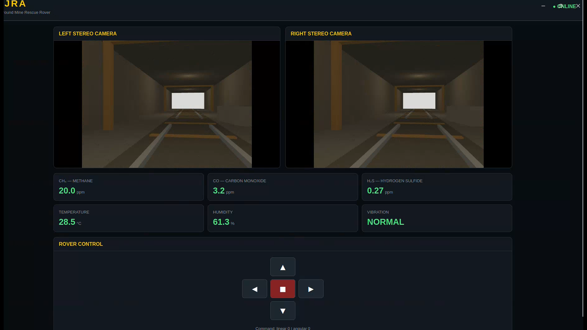

# VAJRA Mine Rescue Rover — Gazebo Simulation

This repository contains the Gazebo simulation of **VAJRA**, an underground mine-rescue rover developed for **Smart India Hackathon (SIH) 2026**.

The simulation models the rover operating in an underground mine environment and provides simulated sensing, stereo camera feeds, rover control, odometry, and a monitoring dashboard using **ROS 2 Humble** and **Gazebo Sim / Gazebo Harmonic**.


## Simulation Preview

### Rover in the Underground Mine



### VAJRA Monitoring Dashboard



## Included

- VAJRA rover URDF with six-wheel differential drive
- Underground mine environment
- Real Gazebo stereo RGB camera sensors
- ROS 2 ↔ Gazebo topic bridging
- Rover velocity control and odometry
- Web dashboard with live left/right camera feeds
- Simulated CH4, CO, H2S, temperature, humidity, and vibration sensing
- Hazard values that vary with rover position
- Supporting stereo camera information and odometry-to-TF nodes
- RTAB-Map/SLAM-related launch and configuration files retained for future development

## Current demo architecture

Gazebo camera sensors → Gazebo Sensors system → `ros_gz_image` → ROS camera topics → VAJRA dashboard

Rover controls → ROS `/model/vajra/cmd_vel` → `ros_gz_bridge` → Gazebo

Gazebo odometry → `ros_gz_bridge` → ROS `/odom` → dashboard/sensor simulation

## Software

- Ubuntu 22.04
- ROS 2 Humble
- Gazebo Sim / Gazebo Harmonic

## Workspace

This repository contains the ROS 2 workspace source structure.

To use the simulation, place the repository contents inside your ROS 2 workspace so that the package folders are located under:

```text
vajra_ws/
└── src/
    ├── vajra_sensors/
    ├── vajra_dashboard/
    └── vajra_description/
```

Build and launch the simulation from the workspace root:

```bash
cd vajra_ws
colcon build
source install/setup.bash
ros2 launch vajra_description vajra_sim.launch.py
```

The generated `build/`, `install/`, and `log/` directories are intentionally not included in this repository.

## Notes

This archive preserves the working source files from the frozen simulation workspace. SLAM/RTAB-Map files are retained but are not required for the current demo configuration.
