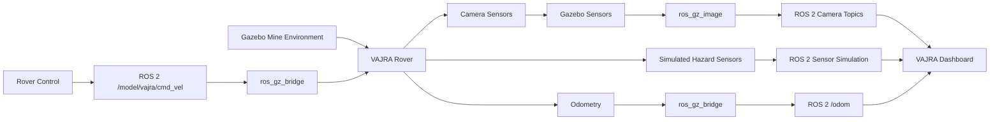

# VAJRA Mine Rescue Rover — Gazebo Simulation

This repository contains the Gazebo simulation of **VAJRA**, an underground mine-rescue rover developed for **Smart India Hackathon (SIH) 2026**.

The simulation models the rover operating in an underground mine environment and provides simulated sensing, stereo camera feeds, rover control, odometry, and a monitoring dashboard using **ROS 2 Humble** and **Gazebo Sim / Gazebo Harmonic**.


## Simulation Preview

### Rover in the Underground Mine


### VAJRA Monitoring Dashboard


## Key Features

- **Six-wheel differential-drive rover** modeled using URDF
- **Underground mine environment** simulated in Gazebo
- **Stereo RGB camera sensors** for simulated visual perception
- **ROS 2 ↔ Gazebo communication** using topic bridging
- **Rover velocity control and odometry** for simulated navigation
- **Live monitoring dashboard** with left and right camera feeds
- **Simulated mine-hazard sensing** for CH₄, CO, H₂S, temperature, humidity, and vibration
- **Position-dependent hazard values** to simulate changing underground conditions
- **Stereo camera information and odometry-to-TF support nodes**
- **RTAB-Map / SLAM configuration files** retained for future development


## System Architecture

The VAJRA simulation connects the Gazebo mine environment, rover sensors, ROS 2 communication, rover control, and the monitoring dashboard.



### Main Communication Paths

- **Camera pipeline:** Gazebo camera sensors → `ros_gz_image` → ROS 2 camera topics → dashboard
- **Hazard sensing:** Simulated CH₄, CO, H₂S, temperature, humidity, and vibration data → ROS 2 sensor simulation → dashboard
- **Odometry:** Gazebo odometry → `ros_gz_bridge` → ROS 2 `/odom`
- **Rover control:** ROS 2 `/model/vajra/cmd_vel` → `ros_gz_bridge` → Gazebo rover

## Software Requirements

The simulation was developed and tested using:

- **Ubuntu 22.04**
- **ROS 2 Humble**
- **Gazebo Sim / Gazebo Harmonic**
- **Python 3**
- **colcon** for ROS 2 workspace building

## ROS 2 Packages

The simulation is organized into three main ROS 2 packages:

| Package | Purpose |
|---|---|
| `vajra_description` | Rover model, mine world, URDF, launch files, and simulation configuration |
| `vajra_sensors` | Simulated environmental and hazard sensing |
| `vajra_dashboard` | Monitoring dashboard and camera-feed visualization |

## Project Structure

```text
VAJRA-Gazebo-Simulation/
├── README.md
├── .gitignore
└── src/
    ├── vajra_sensors/
    │   ├── vajra_sensors/
    │   ├── resource/
    │   ├── test/
    │   ├── package.xml
    │   ├── setup.py
    │   └── setup.cfg
    │
    ├── vajra_dashboard/
    │   ├── vajra_dashboard/
    │   ├── resource/
    │   ├── test/
    │   ├── package.xml
    │   ├── setup.py
    │   └── setup.cfg
    │
    └── vajra_description/
        ├── launch/
        ├── config/
        ├── worlds/
        ├── urdf/
        ├── include/
        ├── src/
        ├── vajra_description/
        ├── package.xml
        └── CMakeLists.txt
```

## Workspace

This repository contains the ROS 2 workspace source structure.

To use the simulation, place the repository contents inside your ROS 2 workspace so that the package folders are located under:

```text
vajra_ws/
└── src/
    ├── vajra_sensors/
    ├── vajra_dashboard/
    └── vajra_description/
```

Build and launch the simulation from the workspace root:

```bash
cd vajra_ws
colcon build
source install/setup.bash
ros2 launch vajra_description vajra_sim.launch.py
```

The generated `build/`, `install/`, and `log/` directories are intentionally not included in this repository.

## Notes

This archive preserves the working source files from the frozen simulation workspace. SLAM/RTAB-Map files are retained but are not required for the current demo configuration.
